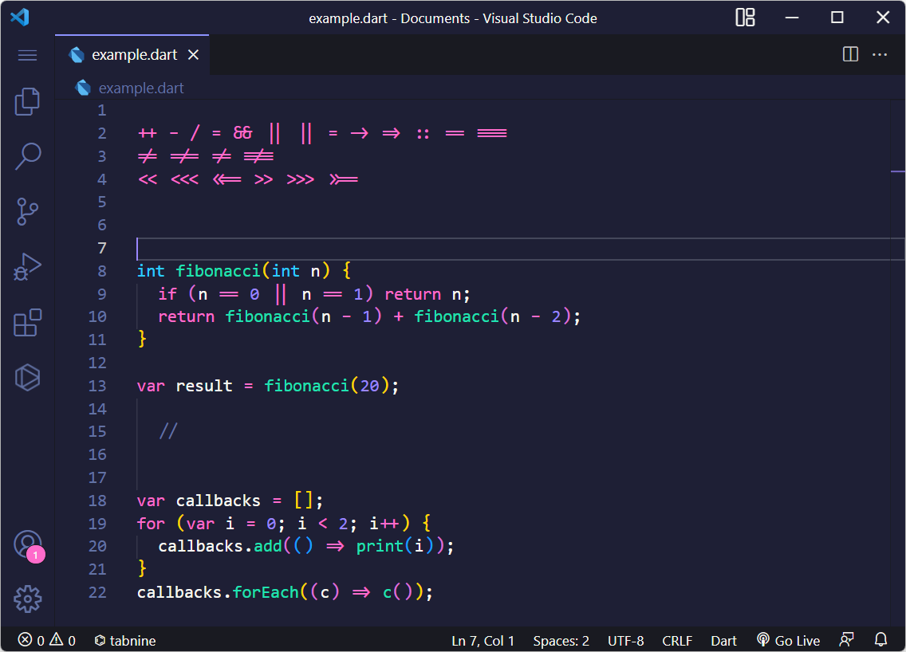
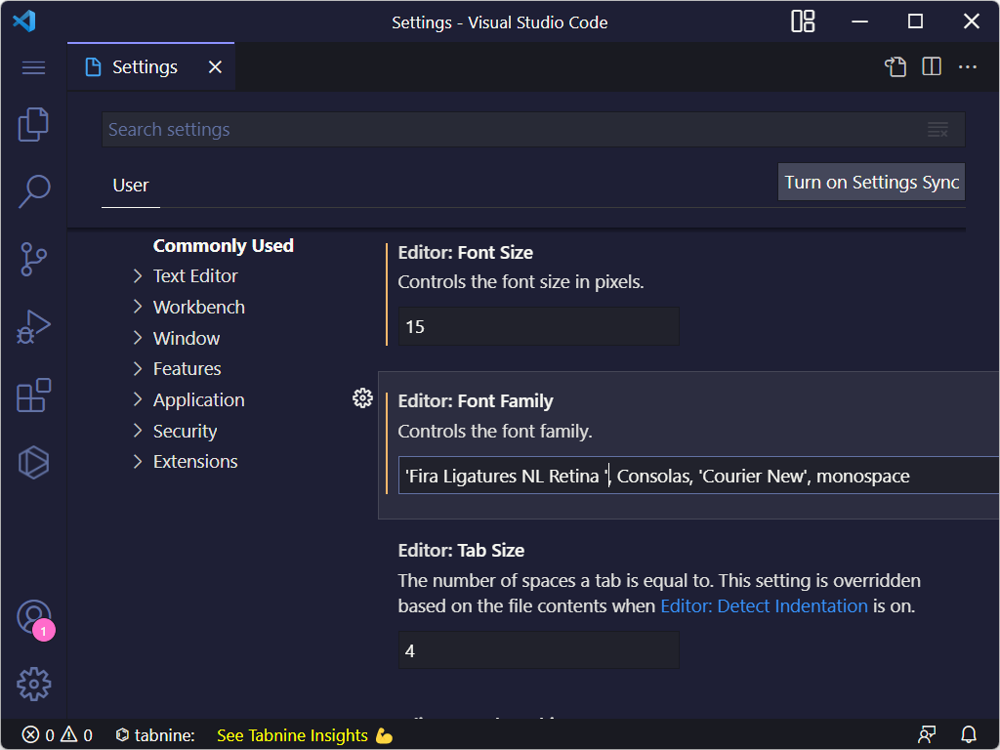

# Font-Base-Ligatures
 Add ligatures with any font in vs code. Ligatures base used by Fira code

# Preview

I will use Consolas fonts and Windows operating systems in this example

> Before use

> After use

# Usage 
1. Install font for your OS
2. Add font family before your font

  Windows, Linux: 
> font-family: 'Fira Ligatures NL Retina'  

  MacOS: 
> font-family: 'Fira Ligatures NL'

